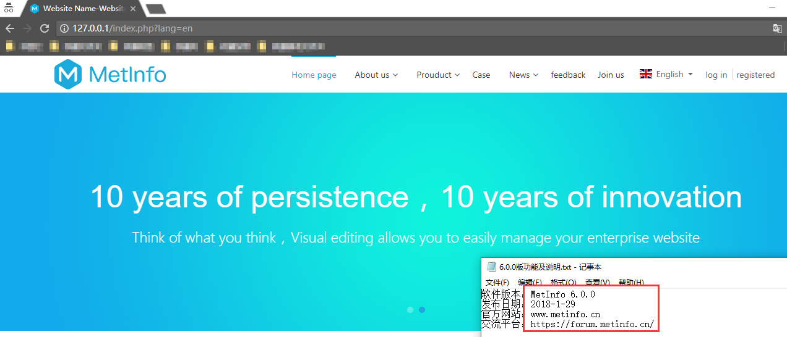
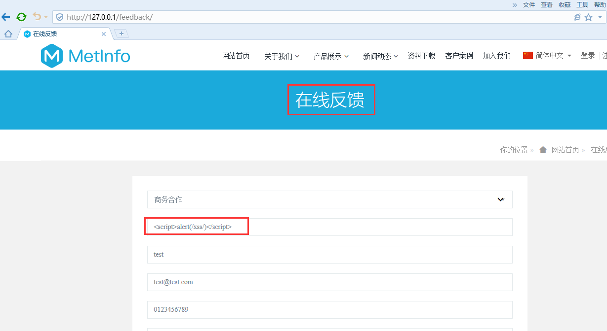
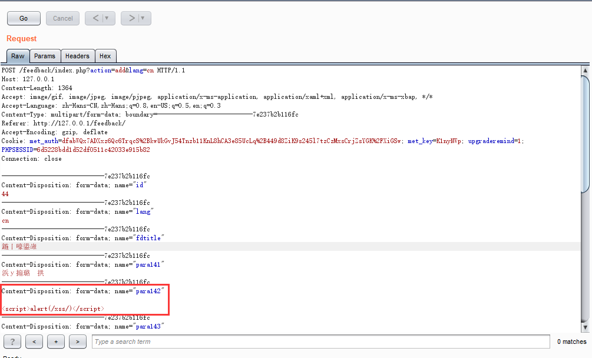
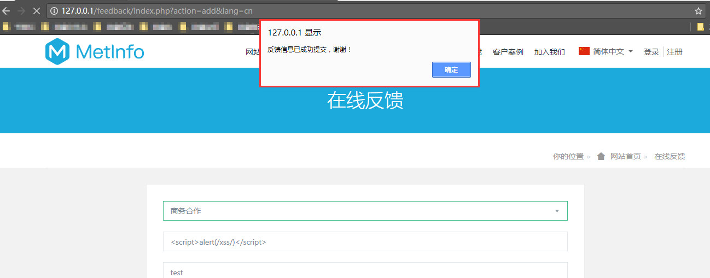
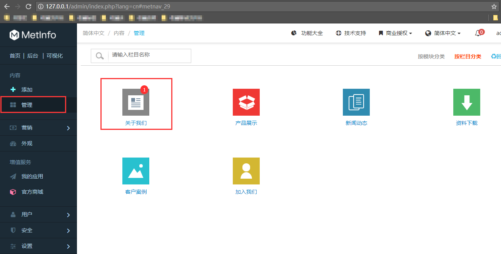
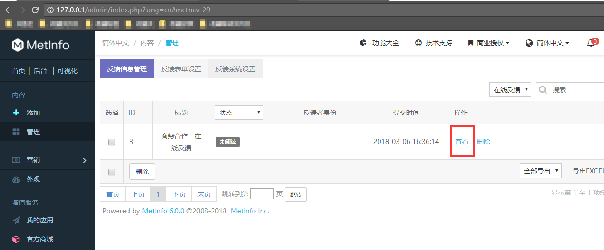
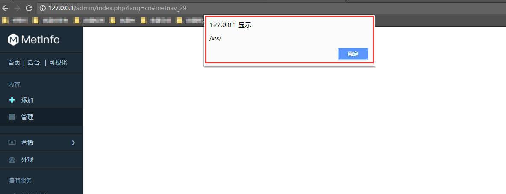

# The MetInfo 6.0.0 feedback management page has a stored XSS #


## 1.Technical Description: ##

locate in /app/system/feedback/web/feedback.class.php line:18 to 37

	  public function dofeedback() {
		global $_M;
      if($_M['form']['action'] == 'add'){
			$this->check_field();
			$this->add($_M['form']);
		}else{
			$classnow = $this->input_class($_M['form']['id']);
			$this->add_input('id', $classnow);
			if($classnow)$this->load_config($_M['lang'], $classnow);
			$data = load::sys_class('label', 'new')->get('column')->get_column_id($classnow);
			$this->add_array_input($data);
			$this->check($data['access']);
			unset($data['id']);
			$this->seo($data['name'], $data['keywords'], $data['description']);
			$this->seo_title($data['ctitle']);
			$this->seo_title($_M['config']['met_fdtable']);
			$this->add_input('fdtitle',$data['name']);
			require_once $this->template('tem/feedback');
		}
	}

Then the foreground form inserts the database.
locate in /app/system/feedback/web/feedback_admin.class.php line:169 to 190

	function doeditor() {
    global $_M;
    nav::select_nav(1);
    $a = 'doeditorsave';
    $class1 = $_M[form][class1];
	$feedbackcfg= load::mod_class('feedback/feedback_handle','new')->get_feedback_config($class1);
    $met_fd_email=$feedbackcfg[met_fd_email][value];
    $id = $_M[form][id];
    $query = "UPDATE {$_M[table][feedback]} SET readok='1' WHERE id='{$_M['form']['id']}'";
    DB::query($query);
    $feedback_list = DB::get_one("select * from {$_M[table][feedback]} where id='$id' and class1 = '$class1'");
    $query = "SELECT * FROM  {$_M[table][parameter]} where lang='{$this->lang}' and ((module='{$this->module}' and class1 = '0') or (module='{$this->module}' and class1 = '$class1')) order by no_order";
    $result = DB::query($query);
    $weburl = $_M[config][weburl];
    while ($list = DB::fetch_array($result)) {
      $info_list = DB::get_one("select * from {$_M[table][flist]} where listid='$id' and paraid='$list[id]' and lang='{$this->lang}'");
      $list[content] = $list[type] == 5 ? (($info_list[info] != '../upload/file/') ? "<a href='{$weburl}" . $info_list[info] . "' target='_blank'>{$_M[word][clickview]}</a>" : $_M[word][filenomor]) : $info_list[info];
      $feedback_para[] = $list;
    }
    $fnam = DB::get_one("SELECT * FROM {$_M[table][column]} WHERE id='$class1' and lang='{$this->lang}'");
    require $this->template('own/article_add');
	}

And Then locate in /app/system/feedback/web/feedback_admin.class.php line:16 to 75

	foreach($feedback_para as $key=>$val){
    $email=$val[id]==$met_fd_email&&$val[content]?"&nbsp;&nbsp;&nbsp;&nbsp;<a href=\"{$_M[url][own_form]}a=doreplyemail&customerid={$customerid}&id={$id}&class1={$_M[form][class1]}&class2={$_M[form][class2]}&class3={$_M[form][class3]}&email={$val[content]}\">{$_M[word][unitytxt_35]}</a>":'';
    echo <<<EOT
     -->
		<div class="v52fmbx_dlbox">
		<dl>
			<dt>{$val[name]}{$_M[word][marks]}</dt>
			<dd>
				$val[content]{$email}
			</dd>
		</dl>
		</div>
    <!--
    EOT;
    }
    echo <<<EOT
     -->
		<div class="v52fmbx_dlbox">
		<dl>
			<dt>{$_M[word][fdeditorTime]}{$_M[word][marks]}</dt>
			<dd>
				{$feedback_list[addtime]}
			</dd>
		</dl>
		</div>
		<div class="v52fmbx_dlbox">
		<dl>
			<dt>{$_M[word][fdeditorFrom]}{$_M[word][marks]}</dt>
			<dd>
				{$feedback_list[fromurl]}
			</dd>
		</dl>
		</div>
		<div class="v52fmbx_dlbox">
		<dl>
			<dt>{$_M[word][feedbackID]}{$_M[word][marks]}</dt>
			<dd>
				{$feedback_list[customerid]}
			</dd>
		</dl>
		</div>
		<div class="v52fmbx_dlbox">
		<h3 class="v52fmbx_hr">{$_M[word][fdeditorRecord]}{$_M[word][marks]}</h3>
		<dl>
			<dd class="ftype_ckeditor">
				<div class="fbox">
					<textarea name="useinfo" data-ckeditor-y="500">{$feedback_list[useinfo]}</textarea>
				</div>
			</dd>
		</dl>
		</div>
		<div class="v52fmbx_submit">
			<input type="submit" name="Submit" value="{$_M[word][Submit]}" class="submit" />
		</div>
       </div>
      </div>
     </div>
    </form>
    <!--
    EOT;

so it prints the contents of the database directly,so we can control the feedback form and inject arbitrary web script or HTML.We can create a stored XSS when admin view feedback.

## 2.PoC ##

Use the Google Chrome open this test site.download this version（```https://www.metinfo.cn/upload/file/MetInfo6.0.0.zip```) and build a test site.


And then we use this url：

> http://127.0.0.1/feedback/index.php




Enter test statements(```<script>alert(/xss/)</script>```) in any input box.

Then we can get such as this page.


Next,we need to known how to trigger this XSS. and we enter the site background.

Now，we are a webmaster in this site,we can view the feedback.

Oh!The XSS will be triggered.


