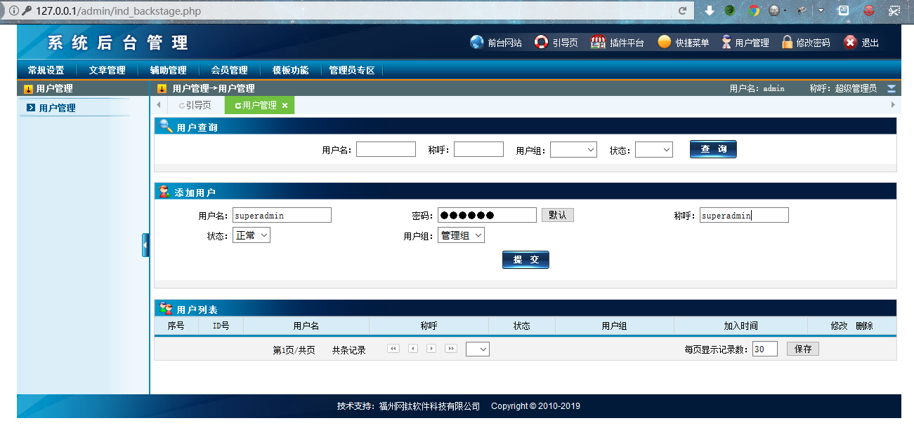
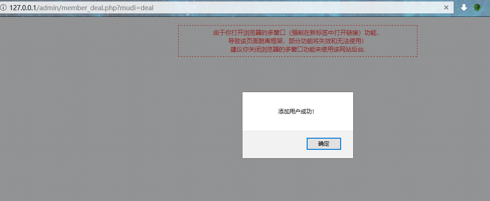
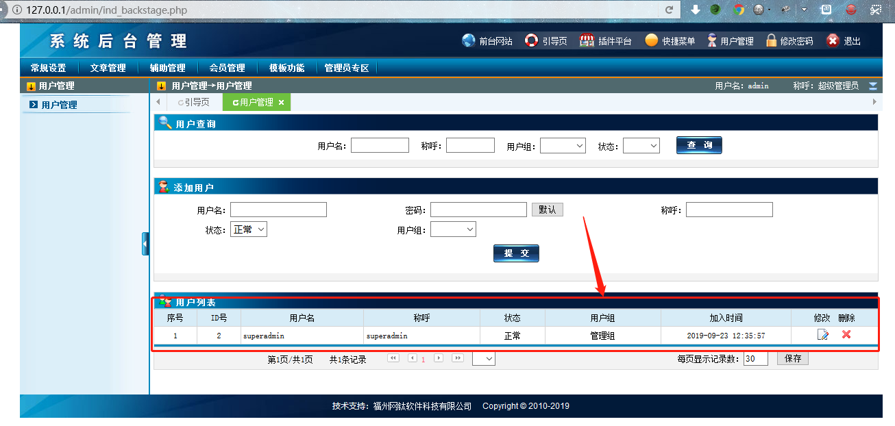
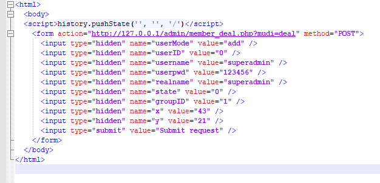

# CSRF vulnerability in Otcms v3.85 #

Description:Otcms v3.85 have CSRF via Admin Panel lead to create new admin account

## 1.Technical Description: ##

Use the Google Chrome open this test site.download this version（```http://d.otcms.com/php/OTCMS_PHP_V3.85.rar```) and build a test site.And we can login in Admin Panel


And then we can carefully fake an html page to trick a logged-in administrative user to click to add a management group account：


And refresh page,add a management group account successfully.



## 2.PoC ##
1、Fake an html such as this.





2、Once the logged in user opens the URL the form will get submitted with active session of  administrator and action get performed successfully.
