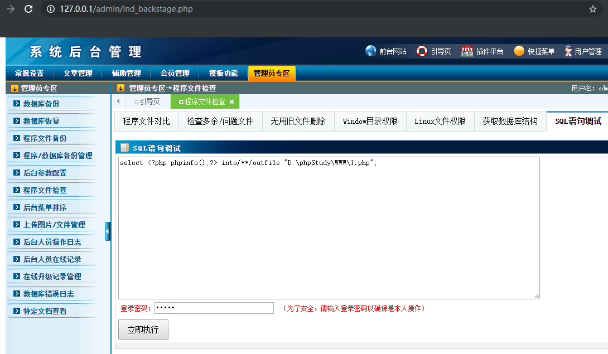

# Code Execution vulnerability in Otcms v3.85 #

Description:Otcms v3.85 have Code Execution via Admin Panel  create a php file,and then get a webshell. 

## Technical Description: ##

Use the Google Chrome open this test site.download this version（```http://d.otcms.com/php/OTCMS_PHP_V3.85.rar```) and build a test site.


And we can login in Admin Panel,absolute path information leaks at the database backup：


Lines 82-92 in the /otcms/inc/classZip.php file, print the absolute path directly, and reveal the website path information.So we can get a absolute path.


And then Code Execution can get a webshell.The following SQL query page we can execute SQL statement to Export php files.


But locate in otcms/admin/sysCheckFile_deal.php has the following code lines 760-772, which limits "into outfile" and limits the hexadecimal conversion.


So the export php file failed.


Finally,we can bypass limit via annotation.



Code execution succeeded and create a new php file.


phpinfo file success created.

