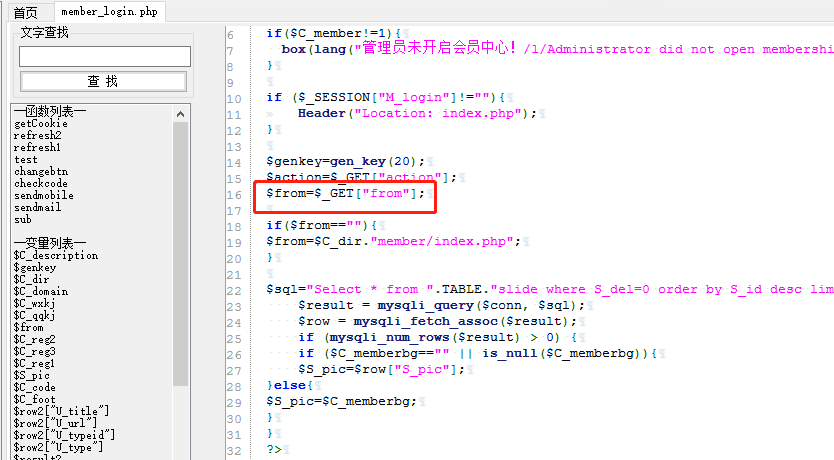
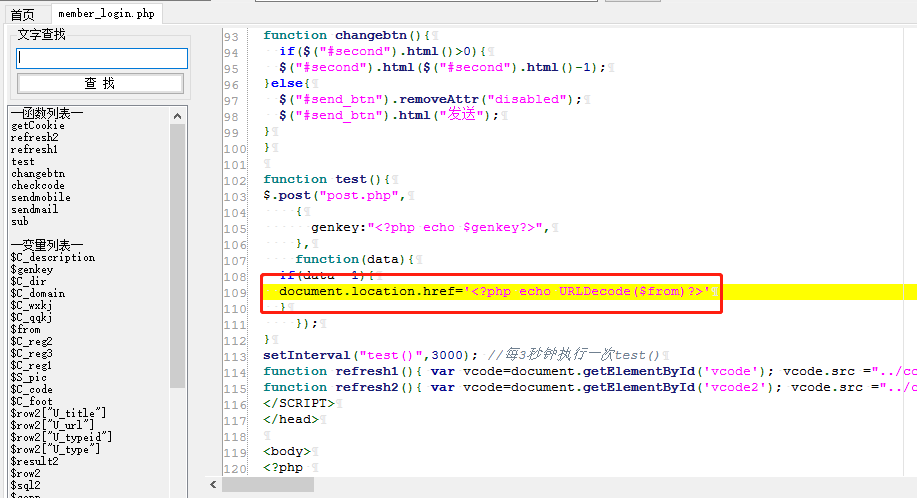
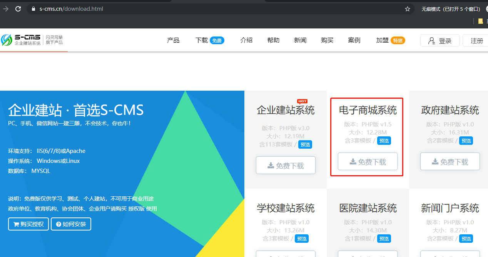
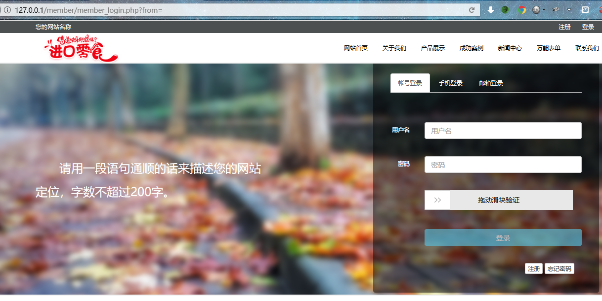

# Cross-site scripting (XSS) vulnerability in S-CMS v1.5 #

Description:Cross-site scripting (XSS) vulnerability in S-CMS v1.5 allows remote attackers to inject arbitrary web script or HTML

## 1.Technical Description: ##

There is an XSS vulnerability in tpl.php via the from parameter,locate in S-CMS/member/member_login.php line: 16



And then,locate in S-CMS/member/member_login.php line: 109,it prints the contents of the page directly after url decode,so we can inject arbitrary web script or HTML.We can create a Cross-site scripting.


## 2.PoC ##

Use the Google Chrome open this test site.download this lastest version（```https://cdn.shanling.top/file/2.mall.php.zip```) and build a test site.


And then we use this url：

> http://127.0.0.1/member/member_login.php?from=




Enter poc:
> %2527%2522--%253E%253C%252fscript%253E%253Cscript%253Ealert%2528%252fxss%252f%2529%253C%252fscript%253E


Then we can refresh this page.The XSS will be triggered.


