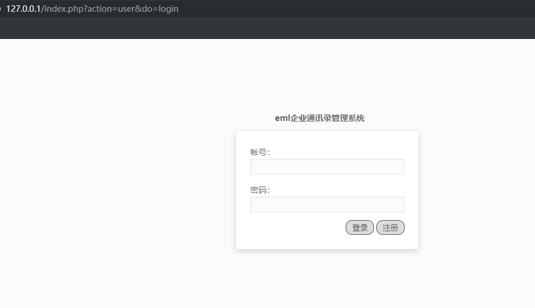

# SQL Injection Vulnerability In EMLsoft 5.4.5 #

Description:An issue was discovered in EMLsoft 5.4.5. upload\eml\action\action.address.php has SQL Injection via the Item parameter.

## 1.Technical Description: ##

Use the Google Chrome open this test site.download this version（```http://www.doilcn.com/d/file/net/code/2018-07/4640c2f5cb03ec2a899f0b88203d43b7.zip```) and build a test site.



locate in /upload/eml/action/action.address.php line:182 to 200


It can be seen that item has parameters, it is brought into the SQL statement for query, so SQL injection is generated.And we can try to find trigger it.Open this page.


And intercept the data packets.


Use the following poc:
```
item[]=2' AND (SELECT 5314 FROM(SELECT COUNT(*),CONCAT(0x7e,(MID((IFNULL(CAST(DATABASE() AS CHAR),0x20)),1,54)),0x7e,FLOOR(RAND(0)*2))x FROM INFORMATION_SCHEMA.PLUGINS GROUP BY x)a) AND 'a'='a
```

Can see the incoming SQL statement, query the current database name.So it has SQL Injection via the Item parameter.
